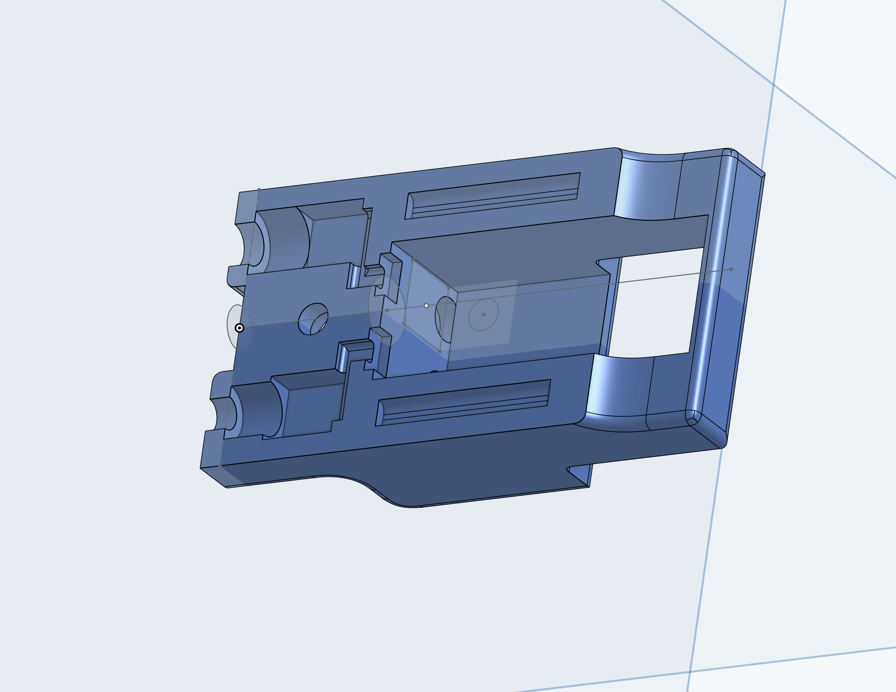
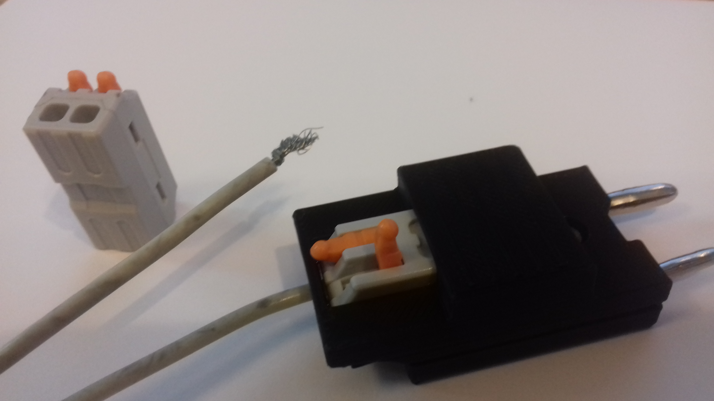

# Two-Prong Body Cord with Wago-Style Connectors

This project presents a 3D printed Two-Prong Body Cord designed for fencing. The 3D model can be accessed through [OnShape](https://cad.onshape.com/documents/28fdac54c1b03cab0d3b86e1/w/d4d30fa18e73995083e20fae/e/a1f624089b5958362320cc5d?renderMode=0&uiState=64a1b75233e2270f4300a3f8).

The objective of this body cord design is to ensure robustness and streamline the assembly process while making it easy to repair. Typically, body cords tend to break near the wire-to-connector interface. This particular design is intended for club settings where the body cord will be lent to students. Additionally, its aesthetic serves as an incentive for students to consider purchasing their own body cords.

To achieve this, I utilized a commonly available [Wago-style](https://www.wago.com/us/wire-splicing-connectors/inline-splicing-connector-with-lever/p/221-2401) lever connector, which acts as a link between the wire and the 4mm, 3mm pins. The advantage of this connector is its simplicity for repairs—trimming the wire and lifting the lever are all that is required. For this project, I used a [generic version](https://www.aliexpress.us/item/3256803684080411.html?gatewayAdapt=glo2usa4itemAdapt) of the connectors.

The overall body cord design is slightly bulkier than desired, and it does not currently include a retaining clip. See the attached images for a closer look at the top view and the assembled body cord.

